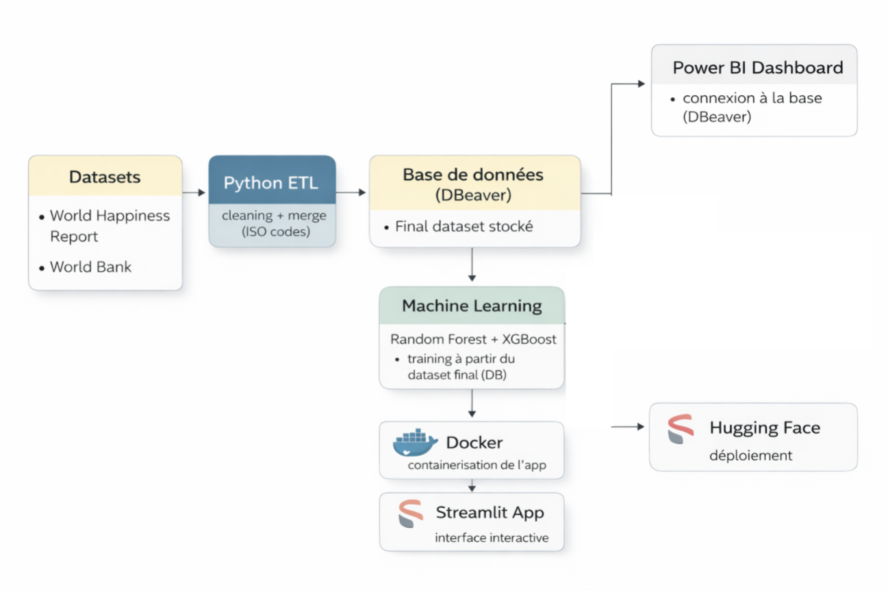
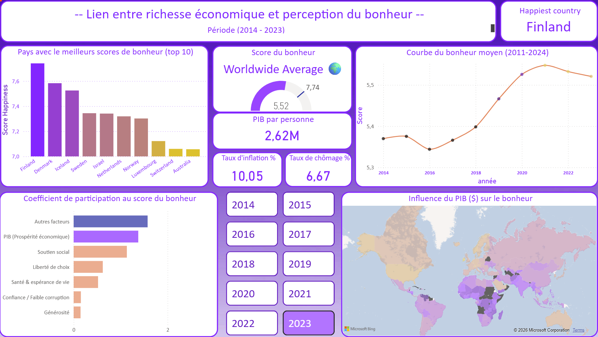
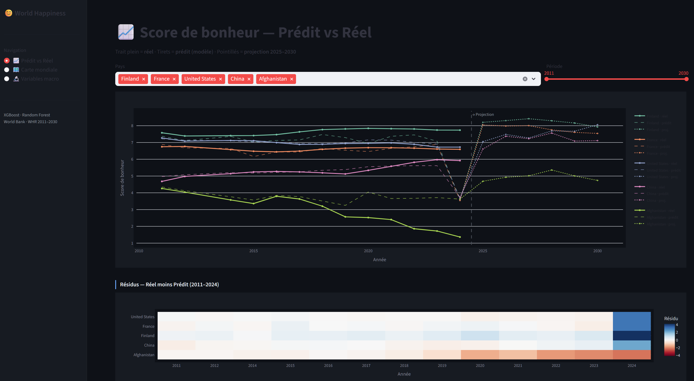

# World Happiness Analytics Project

End-to-end data analysis project exploring the factors influencing happiness worldwide using merged datasets from the World Happiness Report and the World Bank.

The project combines data preprocessing, exploratory analysis, machine learning models and interactive visualization tools.

---

## Project Overview

The objective of this project is to understand which indicators contribute to happiness scores across countries and over time.

The workflow includes:

- Python ETL for cleaning and merging datasets
- Storage of the final dataset in a database accessed via DBeaver
- Dashboard creation in Power BI
- Machine learning models (Random Forest, XGBoost)
- Deployment of an interactive Streamlit application using Docker and Hugging Face

---

## Architecture Overview



Pipeline summary:

1. Raw datasets (World Happiness Report and World Bank)
2. Python ETL process (cleaning, merging, ISO code harmonization)
3. Final dataset stored in a database (accessed with DBeaver)
4. Two main branches:
   - Power BI dashboards connected directly to the database
   - Machine Learning models trained from the same dataset
5. ML models packaged in Docker and deployed through a Streamlit application on Hugging Face

---

## Power BI Dashboard



The dashboard allows:

- comparison between countries
- exploration of happiness drivers
- temporal analysis by year
- filtering and KPI exploration

---

## Machine Learning Approach

Goal: support exploratory analysis and prediction of happiness scores.

Models used:

- Random Forest
- XGBoost

The models were mainly used to:

- identify important features
- detect non-linear relationships
- suggest relevant KPIs to explore in the Power BI dashboard

---

## Streamlit Application



The Streamlit app provides:

- interactive exploration of model outputs
- visualization of predictions
- simplified interface for non-technical users

### Run locally (Python)

```bash
pip install -r requirements.txt
streamlit run streamlit-wh-app/app.py
